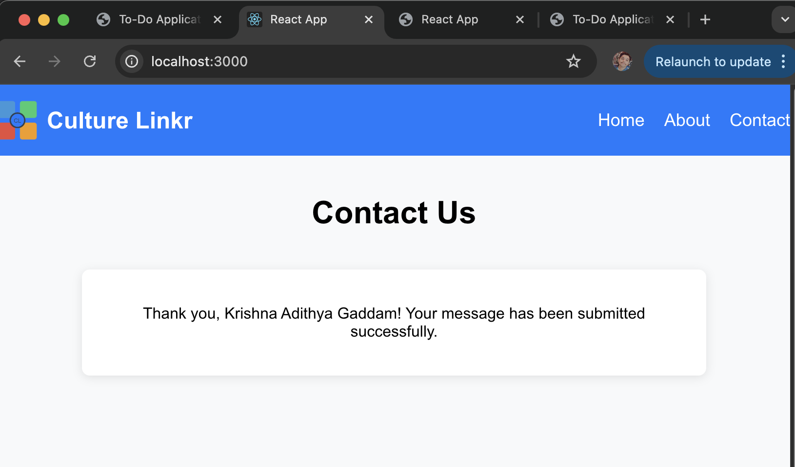

# CultureLinkr

## Overview

This repository contains three challenges: a Frontend Challenge, a Fullstack Challenge, and an API Backend Challenge.

## Prerequisites

Before you begin, ensure you have met the following requirements:

- **Node.js**: Make sure Node.js is installed on your machine. You can download it from [Node.js Official Website](https://nodejs.org/).
- **MongoDB**: Set up a MongoDB database. You can use [MongoDB Atlas](https://www.mongodb.com/cloud/atlas) for a cloud solution or install MongoDB locally.
- **Git**: Ensure you have Git installed to clone the repository. Download it from [Git Official Website](https://git-scm.com/).

## Installation

To install and run the project, follow these steps:

1. **Clone the repository**:

    ```bash
    git clone https://github.com/G-KrishnaAdithya/CultureLinkr.git
    cd CultureLinkr
    ```

2. **Navigate to each challenge folder**:

For the Frontend Challenge:

    ```bash
    cd frontend-challenge
    npm install
    npm start
    ```

For the Fullstack Challenge:

    ```bash
    cd ../fullstack-challenge
    npm install
    npm start
    ```

For the API Backend Challenge:

    ```bash
    cd ../api-backend-challenge
    npm install
    npm start
    ```

3. **Set up environment variables**:

    If necessary, create a `.env` file in the relevant challenge directory and add your MongoDB URI.

    Example:

    ```bash
    MONGODB_URI=mongodb+srv://<username>:<password>@cluster0.mongodb.net/<database>?retryWrites=true&w=majority
    ```

## Challenge Descriptions

### 1. Frontend Challenge
- **Description**: A simple contact form created using React.
- **Output**:
  - Contact form:  
    
  - Submit:  
    
   
### 2. Fullstack Challenge
- **Description**: A To-Do application with a Node.js backend and MongoDB.
- **Output**:
  - Add/ Create:  
    
  - Edit/ Update:  
    
  - Delete:  
    

### 3. API Backend Challenge
- **Description**: An API endpoint that calculates the total value of products based on their attributes.
- **Output**:
  - Example Output:  
    
